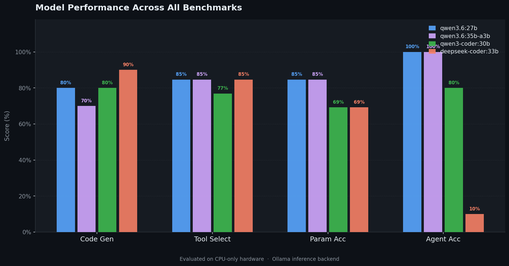
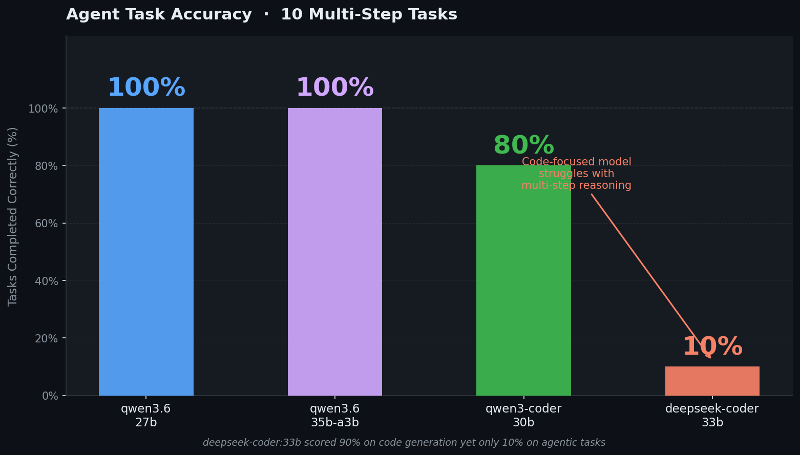

<div align="center">

<a href="https://heyneo.com">
  
</a>

# Local LLM Coding Evaluation Suite

**A benchmark framework for evaluating local LLMs on code generation, function calling, and agent capabilities — running entirely on your own hardware via Ollama.**

</div>

---

## Overview

This project benchmarks local large language models across three dimensions critical for coding agent systems:

| Benchmark | What it tests |
|-----------|--------------|
| **Code Generation** | HumanEval/MBPP-style tasks — write a function, pass the tests |
| **Function Calling** | Tool selection accuracy and parameter correctness |
| **Agent Capabilities** | Multi-step reasoning, planning, and task completion |

All evaluations run locally through [Ollama](https://ollama.com) — no API keys, no cloud, no data leaving your machine.

---

## Models Evaluated

| Model | Architecture | Size on Disk |
|-------|-------------|-------------|
| `qwen3.6:27b` | Dense transformer | ~17 GB |
| `qwen3.6:35b-a3b` | MoE (3B active params) | ~18 GB |
| `qwen3-coder:30b` | MoE (3B active params) | ~17 GB |
| `deepseek-coder:33b` | Dense transformer | ~18 GB |

---

## Results Summary

### Overall Performance

| Model | Code Gen | Tool Select | Params Acc | Agent Acc |
|-------|:--------:|:-----------:|:----------:|:---------:|
| **qwen3.6:27b** | 80.0% | 84.62% | 84.62% | **100.0%** |
| **qwen3.6:35b-a3b** | 70.0% | 84.62% | 84.62% | **100.0%** |
| **qwen3-coder:30b** | 80.0% | 76.92% | 69.23% | 80.0% |
| **deepseek-coder:33b** | **90.0%** | 84.62% | 69.23% | 10.0% |



### Rankings

**Code Generation**
1. 🥇 deepseek-coder:33b — 90%
2. 🥈 qwen3.6:27b / qwen3-coder:30b — 80%
4. qwen3.6:35b-a3b — 70%

**Function Calling (Tool Selection)**
1. 🥇 qwen3.6:27b / qwen3.6:35b-a3b / deepseek-coder:33b — 84.62%
4. qwen3-coder:30b — 76.92%

**Agent Capabilities**
1. 🥇 qwen3.6:27b / qwen3.6:35b-a3b — 100%
3. qwen3-coder:30b — 80%
4. deepseek-coder:33b — 10%

### Key Takeaways

- **Best all-rounder:** `qwen3.6:27b` — top-tier on function calling and agent tasks, competitive on code generation
- **Best code generator:** `deepseek-coder:33b` — 90% code gen accuracy, but struggles badly on multi-step agent tasks (10%)
- **Best balanced performance:** `qwen3-coder:30b` — solid across all three evaluation dimensions
- **Best for agentic systems:** `qwen3.6:27b` or `qwen3.6:35b-a3b` — both hit 100% agent accuracy with strong tool calling



---

## Project Structure

```
local_coding_eval/
├── code_generation_eval.py     # Code gen benchmark (HumanEval-style, 10 tasks)
├── function_calling_eval.py    # Tool use benchmark (13 tasks)
├── agent_eval.py               # Agent capabilities benchmark (10 tasks)
├── orchestrator.py             # Run all three evals across all models
├── results/
│   ├── evaluation_report.md    # Full results report
│   ├── evaluation_summary.json # Machine-readable summary
│   ├── code_gen_*.json         # Per-model code gen results
│   ├── tool_calling_*.json     # Per-model function calling results
│   └── agent_*.json            # Per-model agent results
├── plans/
│   └── evaluation_plan.md      # Evaluation design notes
└── logs/                       # Model pull logs
```

---

## Requirements

- [Ollama](https://ollama.com) installed and running
- Python 3.9+
- 20+ GB RAM (models are 17–18 GB each)
- No GPU required — all evaluations run on CPU

```bash
pip install requests
```

---

## Usage

### Pull models

```bash
ollama pull qwen3.6:27b
ollama pull qwen3.6:35b-a3b
ollama pull qwen3-coder:30b
ollama pull deepseek-coder:33b
```

### Run a single evaluation

```bash
# Code generation
python3 code_generation_eval.py --models qwen3.6:27b qwen3.6:35b-a3b

# Function calling
python3 function_calling_eval.py --models qwen3.6:27b qwen3.6:35b-a3b

# Agent capabilities
python3 agent_eval.py --models qwen3.6:27b qwen3.6:35b-a3b
```

### Run all evaluations across all models

```bash
python3 orchestrator.py
```

Results are saved to `results/` as JSON files and a Markdown report.

---

## Methodology Notes

### Timeout Configuration

| Model family | Timeout |
|-------------|---------|
| `qwen3.6` (27b, 35b-a3b) | **1200s** per task |
| `qwen3-coder`, `deepseek-coder` | **600s** per task |

qwen3.6 models are dense transformers that run slower on CPU-only inference. The extended timeout eliminates timeout artifacts and measures true capability.

### Thinking Token Handling (qwen3.6 models)

qwen3.6 models emit extended chain-of-thought reasoning inside `<think>...</think>` blocks before generating actual output. With the default 2048-token budget, these reasoning blocks exhausted the token limit before any code was generated — causing artificially low scores.

**Fix applied to all three eval scripts:**
- Strip `<think>...</think>` blocks from raw output before parsing
- Increase `num_predict` to 8192 (code gen / agent) and 4096 (function calling)

**Impact:** qwen3.6:27b code generation improved from 40% → 80%; qwen3.6:35b-a3b from 50% → 70%.

---

## Full Report

See [`results/evaluation_report.md`](results/evaluation_report.md) for per-model breakdowns, per-task results, and detailed analysis.

---

<div align="center">
  <sub>Built with ❤️ by <a href="https://heyneo.com">Neo</a> AI Engineer Agent</sub>
</div>
