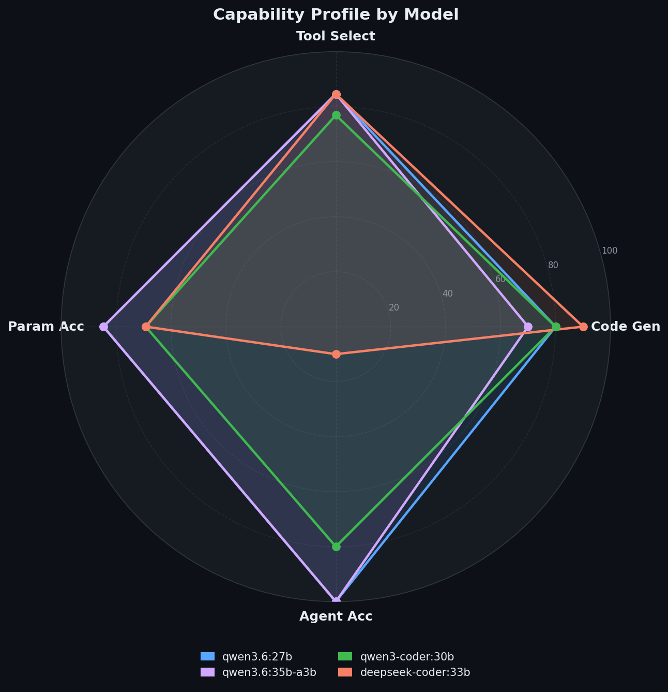
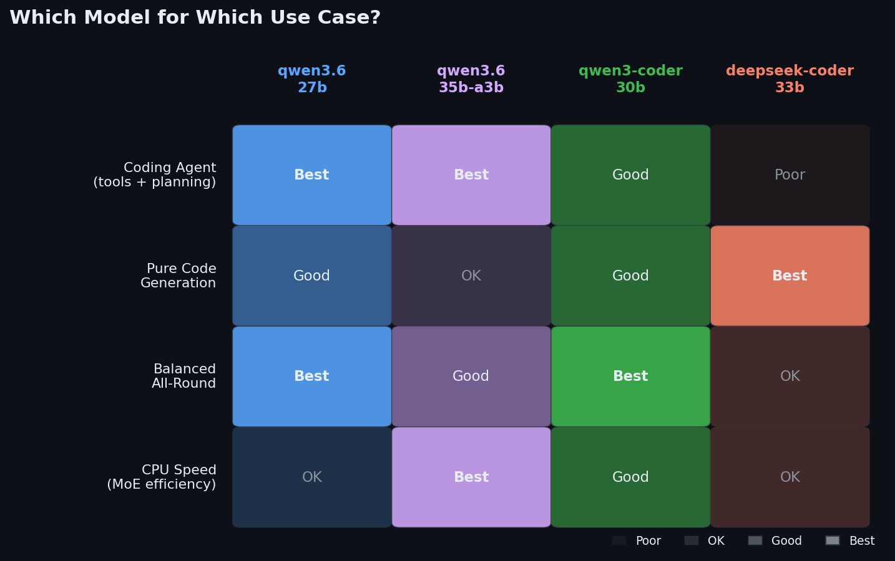

# Which Local LLM Should You Actually Use for Coding and Agentic Workflows?

*A complete evaluation of qwen3.6:27b, qwen3.6:35b-a3b, qwen3-coder:30b, and deepseek-coder:33b — run entirely on local hardware, no cloud, no API keys.*

---

There are a lot of opinions online about which local model is best for coding. Most of them are based on vibes, cherry-picked examples, or benchmarks that don't reflect how these models actually behave inside an agent loop. This post is different. It's a structured evaluation across three dimensions that actually matter for a coding agent: writing code that runs, calling tools correctly, and completing multi-step tasks autonomously.

Everything here was run on a 32-core CPU machine with 125 GB RAM, using Ollama as the inference backend. No GPU. The full evaluation harness, all result files, and the scripts are open source at [github.com/gauravvij/local-llm-coding-eval](https://github.com/gauravvij/local-llm-coding-eval).

---

## What Was Evaluated

Four models, all pulled locally via Ollama:

- `qwen3.6:27b` — Qwen's dense 27B reasoning model
- `qwen3.6:35b-a3b` — Qwen's MoE variant, 35B total but only ~3B active parameters per forward pass
- `qwen3-coder:30b` — Qwen's code-specialized MoE model
- `deepseek-coder:33b` — DeepSeek's dense code-focused model

Three evaluation tracks:

**1. Code Generation** — 10 tasks in the style of HumanEval and MBPP. The model is given a function signature and docstring, asked to complete the implementation, and the output is executed against a test suite. Pass or fail, no partial credit.

**2. Function Calling** — 13 tasks covering tool selection and parameter extraction. The model is given a tool schema and a user request, and must output the correct function call with correct arguments. Two sub-scores: tool selection accuracy and parameter accuracy.

**3. Agent Capabilities** — 10 multi-step tasks requiring planning, reasoning across steps, and arriving at a correct final answer. Scored on answer accuracy, quality of reasoning, and quality of the plan produced.

---

## The Results

### Summary Table

| Model | Code Gen | Tool Selection | Params Accuracy | Agent Accuracy |
|-------|----------|---------------|-----------------|---------------|
| qwen3.6:27b | 80% | 84.62% | 84.62% | **100%** |
| qwen3.6:35b-a3b | 70% | 84.62% | 84.62% | **100%** |
| qwen3-coder:30b | 80% | 76.92% | 69.23% | 80% |
| deepseek-coder:33b | **90%** | 84.62% | 69.23% | 10% |


### Code Generation

deepseek-coder:33b came out on top at 90%, passing 9 out of 10 tasks. qwen3.6:27b and qwen3-coder:30b both hit 80%. qwen3.6:35b-a3b landed at 70%.

The gap between deepseek-coder and the rest is real but not dramatic. For straightforward function-level coding tasks, all four models are competitive. The difference shows up more in edge cases and tasks that require careful handling of types or boundary conditions.

### Function Calling

This is where things get interesting. Three models tied at 84.62% tool selection accuracy: qwen3.6:27b, qwen3.6:35b-a3b, and deepseek-coder:33b. qwen3-coder:30b was slightly behind at 76.92%.

But tool selection is only half the story. Parameter accuracy tells you whether the model not only picked the right function but also filled in the arguments correctly. Here the qwen3.6 models maintained 84.62% while deepseek-coder and qwen3-coder:30b both dropped to 69.23%. That gap matters a lot in practice. A tool call with the wrong arguments fails just as hard as calling the wrong tool.

### Agent Capabilities

This is the most revealing benchmark for anyone building an agentic system.

qwen3.6:27b and qwen3.6:35b-a3b both scored 100% on answer accuracy across 10 multi-step tasks. qwen3-coder:30b scored 80%. deepseek-coder:33b scored 10%.

That last number is not a typo. deepseek-coder:33b, despite being the best pure code generator in this evaluation, essentially cannot do multi-step agentic reasoning. It got 1 out of 10 tasks correct. This is a known characteristic of models that are heavily fine-tuned for code completion: they optimize for producing syntactically correct code given a clear prompt, but they struggle when the task requires planning across multiple steps, maintaining state, and reasoning about intermediate outputs.

Both qwen3.6 models hit 100% answer accuracy across all 10 multi-step tasks, demonstrating strong agent capabilities.




---

## What the Numbers Actually Mean for Your Use Case

**If you're building a coding agent** that needs to use tools, plan across steps, and complete tasks autonomously, use `qwen3.6:27b`. It's the strongest all-rounder: 80% code gen, 84.62% tool calling with correct parameters, and 100% agent accuracy. On CPU-only hardware it runs slower than the MoE models, but the capability profile is the right one for agentic work.

**If you have the memory headroom**, `qwen3.6:35b-a3b` is worth considering. Same agent accuracy as the 27b, and it's actually faster on CPU because of the MoE architecture activating only ~3B parameters per forward pass. The tradeoff is slightly lower code generation accuracy (70% vs 80%).

**If you're building a pure code generation pipeline** with no agentic component, `deepseek-coder:33b` is the best option at 90%. Just don't put it in an agent loop.

**If you want balanced performance across all dimensions**, `qwen3-coder:30b` is interesting. With 80% code gen and 80% agent accuracy, it's not the top performer in any single category but it's the most consistent.



---

## A Note on What Neo Fixed During the Evaluation

This evaluation was produced autonomously by [Neo](https://heyneo.com), an AI engineering agent. One issue came up during the run that's worth mentioning because it affects anyone evaluating reasoning models.

The qwen3.6 models use chain-of-thought reasoning, emitting a `<think>...</think>` block before producing their actual output. With the default 2048-token generation budget, these reasoning blocks were consuming the entire budget before any code was generated. The result was empty `generated_code` fields and scores that looked like 40% and 50% for the two qwen3.6 models.

Neo identified this, stripped the `<think>` blocks from raw output before parsing, and increased the token budget to 8192 for code generation and agent tasks and 4096 for function calling. After the fix, qwen3.6:27b went from 40% to 80% on code generation. qwen3.6:35b-a3b went from 50% to 70%. The initial scores were not measuring model capability at all, just token budget exhaustion.

This is not an exotic edge case. Any evaluation harness that uses a fixed token budget and doesn't account for reasoning model output format will produce misleading results for this class of models.

---

## How This Was Built

The entire evaluation was kicked off from a single prompt to Neo. No scaffolding was written in advance. Neo:

1. Designed the evaluation methodology across three tracks
2. Wrote all three evaluation scripts from scratch (`code_generation_eval.py`, `function_calling_eval.py`, `agent_eval.py`) and an orchestrator
3. Pulled all four models via Ollama
4. Ran the evaluations, identified the qwen3.6 token budget issue, fixed the scripts, and re-ran
5. Collected all results into JSON files and generated the comparative analysis report

The full codebase is at [github.com/gauravvij/local-llm-coding-eval](https://github.com/gauravvij/local-llm-coding-eval).

---

## Replicating or Extending This Yourself

Clone the repo and you have a working evaluation harness:

```bash
git clone https://github.com/gauravvij/local-llm-coding-eval.git
cd local-llm-coding-eval
pip install requests
```

Pull whichever models you want to test:

```bash
ollama pull qwen3.6:27b
ollama pull deepseek-coder:33b
```

Run a specific eval:

```bash
python3 code_generation_eval.py --models qwen3.6:27b deepseek-coder:33b
python3 function_calling_eval.py --models qwen3.6:27b
python3 agent_eval.py --models qwen3.6:27b qwen3.6:35b-a3b
```

Or run everything:

```bash
python3 orchestrator.py
```

Results land in `results/` as JSON files with a Markdown report.

### Extending with Neo

If you want to go further, you can open this project in VS Code with the Neo extension and give it a high-level goal. Neo will read the existing codebase, understand what's already there, and build on top of it. Some things worth trying:

**Add more models:**
> "Add llama3.1:70b and mistral-nemo to the evaluation. Pull them via Ollama and run all three benchmarks. Update the report."

**Expand the benchmark tasks:**
> "The code generation benchmark only has 10 tasks. Add 20 more from HumanEval covering string manipulation, sorting, and recursion. Re-run for all models and update the results."

**Add a new evaluation dimension:**
> "Add a RAG evaluation track. Test each model's ability to answer questions given a retrieved context. Use 10 tasks with a mix of relevant and irrelevant context chunks. Score on answer accuracy and faithfulness."

**Build a comparison dashboard:**
> "Build a Streamlit dashboard that reads the JSON result files and shows interactive charts comparing models across all three benchmarks. Include a model selector and a per-task breakdown view."

**Run on a specific domain:**
> "Replace the code generation tasks with tasks specific to data engineering: writing pandas transformations, SQL queries, and Spark jobs. Re-run the evaluation and report which model performs best on data engineering tasks."

Neo will handle the implementation end to end: writing the code, running it, fixing any issues, and producing the output. You give it the goal, it figures out the rest.

---

## Final Recommendation

For a local coding agent system on CPU hardware:

- **Best all-rounder:** `qwen3.6:27b`
- **Best for memory-constrained systems:** `qwen3.6:35b-a3b` (MoE architecture)
- **Best pure code generator:** `deepseek-coder:33b` (but keep it out of agent loops)
- **Best balanced performance:** `qwen3-coder:30b`

The qwen3.6 models are the right choice for anything agentic. The deepseek-coder result is a useful reminder that benchmark performance on code generation does not predict performance on the kinds of tasks that actually show up in agent workflows.

---

*Evaluation harness and all result files: [github.com/gauravvij/local-llm-coding-eval](https://github.com/gauravvij/local-llm-coding-eval)*

*Built by [Neo](https://heyneo.com)*
